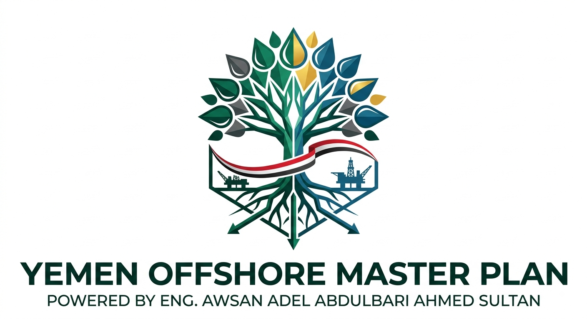

# 🇾🇪 Yemen Integrated Offshore & Onshore Master Plan (Socotra, Shabwa, Hadramout, & Al-Mahrah Hubs)

---

<p align="center">
  
</p>

---

## 📌 Executive Overview
This repository hosts the **Integrated Strategic Master Plan for the Development of Yemen's Offshore and Onshore Blocks**, encompassing the Socotra Oceanic Basin (Blocks 92-97), the Mukalla-Sayhut and Qamar Marine Basins, and the highly productive terrestrial production hubs of **Shabwa, Hadramout, and Al-Mahrah**. 

Spanning an internationally UNCLOS-recognized maritime economic zone of **250,000 to 300,000 square kilometers**, this macro-economic blueprint orchestrates a high-efficiency, Fast-Track Consortium of global energy titans, sovereign wealth funds, and logistics giants to unlock and scale Yemen's massive hydrocarbon and maritime potential within a compressed **3 to 5-year production timeline**.

---

## 🏛️ Proprietary Rights & Intellectual Property Protection

> [!IMPORTANT]
> **LEGAL NOTICE & INTELLECTUAL PROPERTY REGISTRATION**
> All conceptual frameworks, strategic asset-mapping, parallel engineering protocols, and system architecture designs contained herein are the exclusive intellectual property of the Author. Authorized for international consortium review and sovereign development purposes only.

* **Project Architect & Strategist:** Eng. AWSAN ADEL ABDULBARI AHMED SULTAN
* **Origin/Country:** Republic of YEMEN 🇾🇪
* **National Identification Number:** 01010305468
* **Official Contact Directory:** 
  * 📞 +967 777852433
  * 📞 +967 776633003
* **Legal Licensing:** Licensed under the **GNU General Public License v3.0 (GPL-3.0)**. Any unauthorized replication, commercial reuse, or implementation without explicit written consensus from the author is strictly prohibited. © 2026. All Rights Reserved.

---

## ⚙️ Core Architectural Pillars & Consortium Allocation

### 1. Advanced Production Sharing Agreement (PSA) & AI Governance
* **Zero Sovereign Financial Risk:** 100% exploration, seismic surveying, and high-cost drilling expenses are fully absorbed by the international consortium.
* **AWSAN AI System Governance:** Automated, decentralized algorithmic monitoring via **AWSAN AI** to audit "Cost Oil/Gas" operational bills in real-time and automate the "Profit Split" injection directly into sovereign development accounts.

### 2. The Onshore Shabwa & Balhaf LNG Axis
* **DP World (UAE):** Logistics operation and global supply-chain integration of Qana and Al-Nashimah ports.
* **CHEC (China):** Marine engineering, heavy berth upgrades, and deepwater channel dredging.
* **Saudi Aramco (KSA):** Geopolitical technical alignment and cross-border logistical integration.
* **SINOPEC (China):** Construction and routing of strategic overland pipeline networks from Marib-Shabwa (Block 18/S1/S2/4/5) basins.
* **ExxonMobil (USA) & ADNOC (UAE):** Industrial consortium leading the technical rehabilitation and capacity expansion of the Balhaf LNG facility.
* **Chevron (USA) & TotalEnergies (France):** Field technical operation, sub-surface physics optimization, and gas reservoir efficiency management.
* **GE Energy (USA):** Technical execution, heavy turbine maintenance, and strict infrastructure safety governance.
* **United Energy Group - UEG (China):** Fast-track field production and fuel terminal storage engineering.
* **Reliance Industries (India):** Strategic long-term off-taker for crude oil refining and downstream value-added optimization.

### 3. The Hadramout Axis (Production Core & Gas Monetization)
* **PetroMasila (Yemen National Oil Co.) Integrated with International Consortium:** Managing and scaling deep extraction operations across the Say'un-Masilah Basin (Blocks 14/10/51/53), optimizing both conventional and unconventional reservoirs.
* **TotalEnergies & Chevron (France/USA):** Executing strict, anti-manipulation compliance frameworks to maximize associated gas capture and channel it directly into processing facilities.
* **Ash-Shihr & Ad-Dhabah Marine Terminals (DP World / CHEC):** Upgrading deepwater storage capacities and Single Point Mooring (SPM) facilities to accommodate Very Large Crude Carriers (VLCC).
* **GE Energy (USA):** Powering and mitigating emissions across localized gas-to-power grids (PetroMasila & Wadi Hadramout power plants) to secure regional industrial self-sufficiency.

### 4. The Al-Mahrah Axis (Eastern Logistics Gateway & Marine Border)
* **Adani Ports (India) & DP World (UAE):** Transforming Nishtun Port into a modernized, open-access regional trade and logistical transshipment hub on the Arabian Sea.
* **CHEC (China):** Executing large-scale coastal reclamation, heavy breakwater construction, and massive dry-dock storage infrastructure.
* **Saudi Aramco & SINOPEC (KSA/China):** Analyzing and deploying strategic overland cross-border transport pipelines across the Gizeh-Qamar Basin (Blocks 84/85), anchoring direct strategic export platforms.
* **TPAO (Turkey) & CNOOC (China):** Initiating deepwater marine seismic exploration across Al-Mahrah’s offshore blocks (Blocks 61/62 Atab) to sync reservoir models with the geological extensions of Western Oman.

### 5. The Offshore Socotra Oceanic Basin & Bunkering Station
Targeting a compressed **Fast-Track Deployment of 200 to 500 Offshore Platforms** utilizing multi-lateral/cluster directional drilling from unified subsea templates to exploit ultra-deepwater gas and oil reservoirs.

* **Package A (6-Platform Fast-Track Gas Axis):** Led by **ExxonMobil**, **Chevron**, and **CNOOC** with **Türkiye Petrolleri Anonim Ortaklığı (TPAO)** deploying its advanced state-owned deepwater drillship fleet (e.g., *Abdulhamid Han*) to eliminate rig-rental overheads.
* **Package B (4-Platform Fast-Track Oil Axis):** Led by **Zhenhua Oil**, **UEG**, and **ADNOC** for rapid shelf-field exploitation and immediate cash-flow monetization.
* **Technological Execution:** **Halliburton** and **Schlumberger** executing real-time digital well-path telemetry and advanced horizontal multi-lateral branching.
* **Port Readiness & Pipeline Synchronization Protocol:** Concurrent parallel engineering executed by **SINOPEC** and **CHEC** to unify pipeline networks from all basins (Shabwa, Socotra, Hadramout, Al-Mahrah) directly into immediate export readiness from Day 1.
* **Sovereign Infrastructure Funding:** **Public Investment Fund (PIF) of Saudi Arabia** driving the funding for macro-logistics zones, international free zones, and eco-tourism infrastructure across the connected hubs.
* **Green Energy Integration:** **ACWA Power** and **GE Energy** implementing 100% sustainable offshore wind and solar grids to power processing networks, platforms, and coastal facilities.
* **Super-Bunkering Hub:** Establishing a global international marine refueling station in Socotra targeting the handling and servicing of **over 200,000 vessels annually** under the automated transit orchestration of the **AWSAN AI** system.

---

## 📂 Repository Directory Layout (Python-Driven Architecture)

```text

The algorithmic and computational core of this master plan is built using a Python-driven data structure to model geofluid dynamics, supply-chain flow, and financial governance:
├── .gitignore               # Standard Python ignores (caches, environments)
├── LICENSE                  # GNU GPL-3.0 Legal Framework for Intellectual Property Protection
├── README.md                # Master Blueprint and Sovereign Registration (Eng. AWSAN ADEL)
├── docs/                    # Detailed Geological Profiles and Macro Basin Metrics
│   ├── blocks_metrics.md    # Datasheet for Regional Hydrocarbon Blocks & Prospective Volumes
│   └── granular_blocks_inventory.md # Granular Inventory of Yemen's Hydrocarbon Assets (Offshore & Onshore)
├── Documentation/           # Master Strategic Agreements and Transnational Frameworks
│   └── Global-Partners/     # Operational Strategy Guidelines per Sovereign Country Member
│       ├── National_Engineers_Deployment_Program.md # Comprehensive Cadres Up-skilling & Training Matrix
│       ├── Regional_PSA_Best_Practices.md # Regional Contractual Benchmarking (Egypt, Oman, KSA, Somalia)
│       └── Turkey_TPAO_Deepwater_Fleet_Strategy.md # TPAO Drillship Operations Fleet & CAPEX Optimization
├── src/
│   ├── awsan_ai_core/       # Core Financial Auditing and Anti-Coning Subsurface Governance
│   │   └── governance_engine.py  # AI Financial-Geophysical Auditing Core and Coning Safe-Guard
│   ├── logistics_sync/      # Port Synchronization and Supply-Chain Routing Frameworks
│   │   └── port_pipeline_sync.py # Parallel Engineering Monitor and Super-Bunkering Dispatch Algorithm
│   └── reservoir_models/    # Multi-lateral / Cluster Well Flow Telemetry Simulators
│       └── well_telemetry_sim.py # Joshi-Equation Production Modeler for Multi-Branch Platforms
└── tests/                   # Verification Scripts and Automated Governance Stress-Testing
    └── test_governance_engine.py # Automated Test Suite with Dynamic Future Port Injection Framework


---

# 🇾🇪 المخطط الاستراتيجي للمسار السريع للمناطق البحرية والبرية اليمنية (المحاور المتكاملة: سقطرى، شبوة، حضرموت، والمهرة)

---

<p align="center">
  
</p>

---
## 📌 نظرة عامة تنفيدية
يحتوي هذا المستودع على **المخطط الاستراتيجي المتكامل لتطوير القطاعات البحرية والبرية اليمنية**، والذي يشمل (منطقة حوض سقطرى البحري: القطاعات 92-97)، و(حوض المكلا-سيحوت وحوض قمر البحري)، بالإضافة إلى محاور الإنتاج والربط البري والساحلي في (شبوة، حضرموت، والمهرة) [1.1.2، 1.4.3].

تغطي هذه الخريطة الاقتصادية الكلية مساحة مائية اقتصادية خالصة معترف بها دولياً وأممياً بموجب اتفاقية قانون البحار (UNCLOS) تتراوح بين **250,000 إلى 300,000 كيلومتر مربع** [1.1.3، 1.4.1]. وتدير ائتلافاً دولياً عالي الكفاءة (Fast-Track Consortium) يضم كبرى كتل الطاقة، الصناديق السيادية، وعمالقة اللوجستيات العالميين لفتح وتوسيع نطاق الإمكانيات الهيدروكربونية والملاحية لليمن ضمن **جدول زمني مضغوط للإنتاج يتراوح بين 3 إلى 5 سنوات** [1.1.2، 1.3.1].

---

## 🏛️ حقوق الملكية الفكرية وحماية المخطط الاستراتيجي

> [!IMPORTANT]
> **إشعار قانوني وتوثيق الملكية الفكرية**
> إن جميع الأطر المفاهيمية، وخرائط الأصول الاستراتيجية، وبروتوكولات الهندسة الموازية، وتصاميم هندسة الأنظمة الواردة في هذا المستودع هي ملكية فكرية حصرية للمؤلف. ومصرح بها فقط لأغراض مراجعة الائتلاف الدولي والتنمية السيادية للجمهورية اليمنية.

* **مهندس ومخطط المشروع الاستراتيجي:** م. أوسان عادل عبد الباري أحمد سلطان (Eng. AWSAN ADEL ABDULBARI A. SULTAN)
* **بلد المنشأ:** الجمهورية اليمنية 🇾🇪
* **الرقم الوطني (المنشأ):** 01010305468
* **دليل الاتصال الرسمي:**
  * 📞 00967777852433
  * 📞 00967776633003
* **الترخيص القانوني:** مرخص بموجب **رخصة جنو العمومية الإصدار 3.0 (GNU GPL-3.0)**. ويُحظر تماماً أي استنساخ غير مصرح به، أو إعادة استخدام تجاري، أو تنفيذ دون موافقة خطية صريحة من المؤلف. © 2026. جميع الحقوق محفوظة.

---

## ⚙️ الركائز الهيكلية الأساسية وتوزيع الائتلاف الدولي

### 1. اتفاقية مشاركة الإنتاج المطورة (PSA) وحوكمة الذكاء الاصطناعي
* **صِفر مخاطر مالية سيادية:** يتحمل الائتلاف الدولي بالكامل 100% من نفقات الاستكشاف، المسوح الزلزالية، وتكاليف الحفر المرتفعة [1.1.3، 1.4.1].
* **حوكمة نظام أوسان للذكاء الاصطناعي (AWSAN AI):** مراقبة خوارزمية مؤتمتة ولامركزية عبر نظام **(AWSAN AI)** للتدقيق في فواتير العمليات و"نفط وغاز التكلفة" لحظياً، وأتمتة حقن "تقاسم الأرباح" مباشرة في الحسابات السيادية للتنمية المستدامة.

### 2. محور شبوة البري ومنشأة بلحاف للغاز المسال
* **موانئ دبي العالمية (DP World):** العمليات اللوجستية والربط العالمي الشامل لسلاسل الإمداد والتجارة لمينائي (قنا والنشيمة).
* **الشركة الصينية لهندسة الموانئ (CHEC):** الهندسة البحرية الثقيلة، وتحديث وتوسيع الأرصفة وتعميق القنوات الملاحية العميقة.
* **أرامكو السعودية (Saudi Aramco):** المواءمة الفنية الجيوسياسية والتخطيط للربط اللوجستي العابر للحدود.
* **سينوبك الصينية (SINOPEC):** بناء وتوجيه شبكات الأنابيب الاستراتيجية لربط حقول الإنتاج البرية في أحواض السبعتين (القطاعات 18/S1/S2/4/5).
* **إكسون موبيل وأدنوك (ExxonMobil / ADNOC):** قيادة التحالف الصناعي لإعادة إنعاش وتحديث وتوسيع السعة الإنتاجية لمنشأة بلحاف للغاز الطبيعي المسال (LNG).
* **شيفرون وتوتال إنرجيز (Chevron / TotalEnergies):** العمليات الفنية الميدانية، وتحسين فيزياء المكامن، وإدارة كفاءة مستودعات الغاز.
* **جي إي إنرجي (GE Energy):** التنفيذ التقني الكامل، الصيانة الشاملة للتوربينات الثقيلة، والحوكمة الصارمة لسلامة البنية التحتية.
* **مجموعة يونايتد إنرجي - UEG:** الإنتاج الميداني السريع وهندسة مستودعات ومنشآت استقبال الوقود والمشتقات.
* **ريلاينس للصناعات الهندية (Reliance Industries):** الشريك التجاري الاستراتيجي لشراء النفط الخام طويل الأجل وتكريره لتعظيم القيمة المضافة لقطاع الصناعات التحويلية.

### 3. محور حضرموت (قلب الإنتاج وتسييل الغاز)
* **شركة بترومسيلة الوطنية (PetroMasila) بالتكامل مع الائتلاف الدولي:** إدارة وتطوير عمليات الإنتاج العميق في (حوض سيئون-المسيلة - القطاعات 14/10/51/53) وتطوير المكامن التقليدية وغير التقليدية [1.1.3، 1.4.3].
* **توتال إنرجيز وشيفرون (TotalEnergies / Chevron):** حظر التلاعب بالاتفاقيات وتطبيق المعايير الصارمة لرفع كفاءة تجميع الغاز المصاحب وتوجيهه لمنشآت المعالجة [1.1.2، 1.4.3].
* **ميناء الشحر النفطي وميناء الضبة (DP World / CHEC):** تحديث خزانات الاستكشاف البحرية ومصائد الشحن وتطوير منصات الربط الأحادي (SPM) لاستقبال ناقلات النفط فائقة الضخامة [1.4.4، 1.4.5].
* **جي إي إنرجي (GE Energy):** تشغيل ومكافحة الانبعاثات في محطات الطاقة الغازية المحلية (محطة بترومسيلة ووادي حضرموت) لتأمين الاكتفاء الذاتي من الطاقة للمحور [1.2.3، 1.2.5].

### 4. محور المهرة (الجسر البري والبحر الشرقي)
* **موانئ أداني وموانئ دبي (Adani Ports / DP World):** إدارة وتطوير ميناء نشطون الاستراتيجي وتحويله إلى مركز ربط تجاري ولوجستي إقليمي مفتوح على بحر العرب وممتد نحو المحيط الهندي.
* **الشركة الصينية لهندسة الموانئ (CHEC):** القيام بأعمال استصلاح السواحل وبناء كواسر الأمواج والمخازن الجافة العملاقة في المحور الشرقي.
* **أرامكو السعودية وسينوبك (Saudi Aramco / SINOPEC):** دراسة وتنفيذ أنابيب النقل والربط الجغرافي العابر للحدود عبر (حوض جيزة-قمر البري - القطاعات 84/85)، وتثبيت منصات النقل الاستراتيجي المباشر [1.3.2، 1.4.3].
* **مؤسسة البترول التركية و CNOOC الصينية (TPAO / CNOOC):** إطلاق مسوحات استكشافية متقدمة في القطاعات البحرية التابعة للمهرة (قطاعات 61/62 عتاب) لربط المكمن الرسوبي بالامتدادات الجيولوجية لغرب سلطنة عُمان [1.3.2، 1.4.3].

### 5. محور حوض سقطرى البحري ومحطة التموين الفائقة
يستهدف التوسع الميداني الأفقي السريع للوصول من **200 إلى 500 منصة بحرية (Offshore Platforms)** باستخدام تقنية الحفر المتوجه ومتعدد المسارات (Multi-lateral) من قوالب قاعية موحدة لاستغلال مكامن الغاز والنفط في المياه العميقة [1.1.2، 1.4.3].

* **الحزمة (أ) - مسار الغاز السريع لـ 6 منصات:** بقيادة **إكسون موبيل**، **شيفرون**، و **CNOOC الصينية**، مع قيام **مؤسسة البترول التركية (TPAO)** بنشر أسطول سفن حفر المياه العميقة المملوك لها (مثل سفينة *عبد الحميد خان*) للقضاء على التكاليف الباهظة لاستئجار الحفارات الخارجية [1.1.2، 1.2.7].
* **الحزمة (ب) - مسار النفط السريع لـ 4 منصات:** بقيادة **تشنهوا للنفط (Zhenhua Oil)**، **UEG**، و **أدنوك (ADNOC)** للاستغلال السريع لحقول الجرف القاري وتحقيق تدفق نقدي تجاري فوري [1.1.2، 1.4.3].
* **التنفيذ التكنولوجي الفائق:** تتولى شركتا **هاليبرتون وشلمبرجير (Halliburton / Schlumberger)** تقديم الرقابة الرقمية والتتبع اللحظي لمسارات الآبار والقيام بالحفر المتعدد الفروع الأفقية.
* **بروتوكول جاهزية الموانئ ومزامنة الأنابيب:** هندسة موازية ومتزامنة بالكامل تقودها **سينوبك** و **CHEC** لربط حقول النفط والغاز في أحواض (شبوة، حضرموت، المهرة، وسقطرى) بشبكة أنابيب موحدة ومنظومات شحن وتصدير جاهزة من اليوم الأول [1.1.2، 1.4.3].
* **التمويل الاستثماري السيادي للبنية التحتية:** **صندوق الاستثمارات العامة السعودي (PIF)** يقود الاستثمارات التمويلية لبناء المناطق الحرة العالمية، اللوجستيات، والمشاريع السياحية البيئية في سقطرى وكامل الموانئ المرتبطة.
* **دمج حلول الطاقة النظيفة:** تطوير مشروعات الطاقة المتجددة (الرياح البحرية والشمس) عبر **أكوا باور (ACWA Power)** و **جي إي (GE)** لتأمين طاقة خضراء مستدامة بنسبة 100% لكامل شبكات المعالجة والمنصات والموانئ الساحلية.
* **محطة التموين الفائقة (Super-Bunkering Hub):** إنشاء محطة دولية لتموين السفن في موقع سقطرى الاستراتيجي تستهدف خدمة ومناولة **أكثر من 200,000 سفينة سنوياً** تدار ملاحياً ولوجستياً ومؤتمتة بالكامل عبر نظام **(AWSAN AI)**.

---

## 📂 هيكلية المستودع الرقمية (الأنظمة الموجهة بلغة بايثون)

تعتمد البنية التحتية البرمجية والحسابية لهذا المخطط الاستراتيجي على هيكلية مدفوعة بلغة بايثون لنمذجة ديناميكيات السوائل، تدفقات سلاسل الإمداد، والحوكمة المالية:

```text
├── .gitignore               # الملفات المستبعدة القياسية للبايثون (المخازن المؤقتة والبيئات)
├── LICENSE                  # الإطار القانوني لرخصة GNU GPL-3.0 لحماية الملكية الفكرية والسيادية
├── README.md                # المخطط التوجيهي الرئيسي والتوثيق السيادي للمشروع (Eng. AWSAN ADEL)
├── docs/                    # التوصيفات الجيولوجية التفصيلية وبيانات القطاعات والمكامن
│   ├── blocks_metrics.md    # وثيقة البيانات الجيولوجية وإحصاءات القطاعات النفطية والغازية لليمن
│   └── granular_blocks_inventory.md # الجرد التفصيلي للأصول الهيدروكربونية (القطاعات البرية والبحرية)
├── Documentation/           # مجلد الاتفاقيات الاستراتيجية الكبرى وأطر العمل متعددة الجنسيات
│   └── Global-Partners/     # أدلة الإستراتيجية التشغيلية للدول الأعضاء والشركاء الدوليين
│       ├── National_Engineers_Deployment_Program.md # البرنامج التنفيذي لتأهيل وتشغيل الكوادر الهندسية الوطنية
│       ├── Regional_PSA_Best_Practices.md # مصفوفة القياس الإقليمي وتحسين عقود مشاركة الإنتاج (PSA)
│       └── Turkey_TPAO_Deepwater_Fleet_Strategy.md # استراتيجية أسطول حفر المياه العميقة لمؤسسة TPAO وتحسين التكاليف
├── src/
│   ├── awsan_ai_core/       # النواة البرمجية لحوكمة العقود المالية وحماية باطن الأرض من الكونينج
│   │   └── governance_engine.py  # محرك الرقابة والتدقيق المالي الجيوفيزيائي لحقول الغاز والنفط
│   ├── logistics_sync/      # خوارزميات مزامنة الموانئ الساحلية والتسعة وتوجيه شبكات الأنابيب
│   │   └── port_pipeline_sync.py # محرك التزامن الهندسي الموازي وجدولة حركة أسطول التموين الفائق
│   └── reservoir_models/    # أجهزة محاكاة تدفق الآبار متعددة الفروع والتتبع اللحظي بالأحواض
│       └── well_telemetry_sim.py # محاكي التدفق الهيدروليكي وتيليمتري الآبار الموجهة والقبب الملحية للأوفشور
└── tests/                   # برامج التحقق الآلي والاختبارات الشاملة للتأكد من خلو النظام من الثغرات
    └── test_governance_engine.py # ملف الاختبارات ومحاكاة الإجهاد اللوجستي وحقن الموانئ المستقبلية ديناميكياً

```

